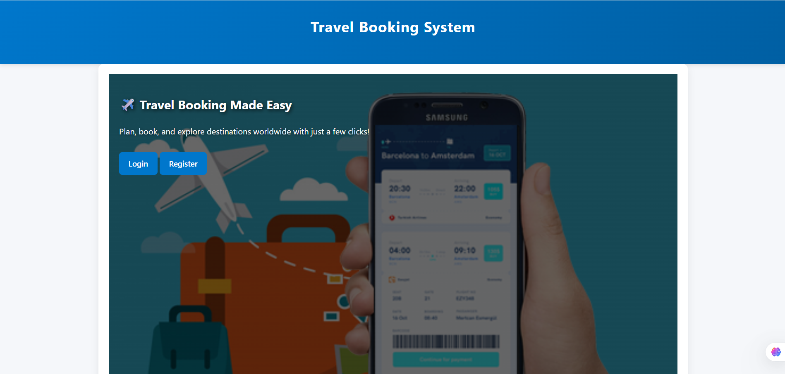
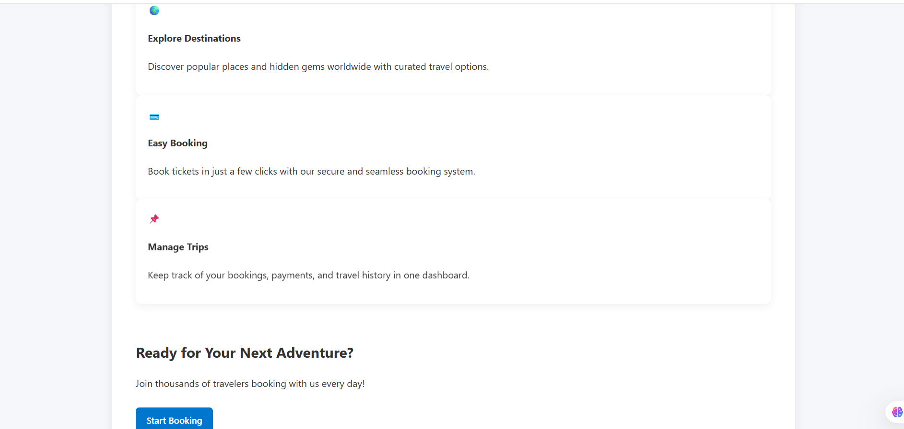
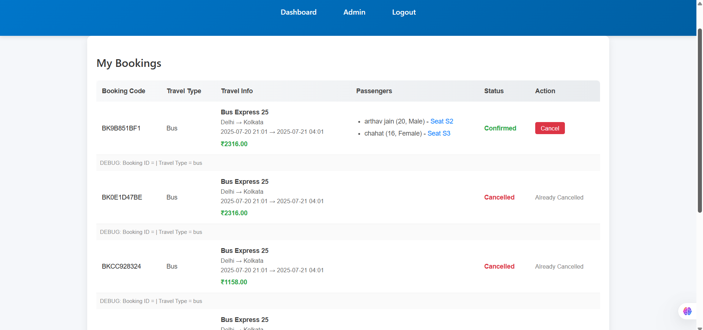
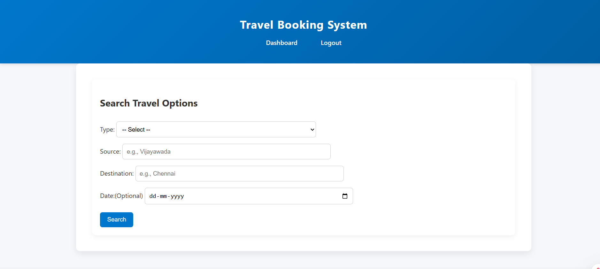

# Travel Booking System

## Overview

✈️ **Travel Booking System**

A full-stack web application for searching, booking, and managing travel options such as flights, trains, and buses. Built with Django on the backend and Bootstrap for the frontend, it provides a seamless and user-friendly booking experience.

---

## Features

### User Management

- Secure user registration, login, and logout.
- Profile management to update personal information.

### Travel Options

- Browse available travel options (flights, trains, buses).
- Search and filter by type, source, destination, and date.

### Booking System

- Book tickets quickly and easily.
- Automatic price calculation based on the number of seats.
- View booking details instantly after confirmation.

### Booking Management

- Track active and past bookings in one place.
- Option to cancel bookings anytime.

### Frontend

- Clean, modern, and responsive design.
- Optimized for both desktop and mobile devices.
- Styled using Bootstrap for consistency and speed.

---

## Technologies Used

- **Backend**: Django (Python)
- **Frontend**: HTML, CSS, Bootstrap
- **Database**: SQLite (with option to migrate to MySQL/PostgreSQL)
- **Other Tools**: Django Admin Panel, Django ORM

---

## Project Structure

```
Travel-Booking-System/
├── README.md
├── travel_booking/
│   ├── db.sqlite3
│   ├── manage.py
│   ├── core/
│   │   ├── templates/
│   │   │   ├── base.html
│   │   │   ├── user/
│   │   │   │   ├── home.html
│   │   │   │   ├── register.html
│   │   │   │   ├── login.html
│   │   │   │   ├── my_bookings.html
│   │   │   │   ├── ticket.html
│   │   │   ├── admin/
│   │   ├── models/
│   │   │   ├── booking.py
│   │   │   ├── bus.py
│   │   │   ├── flight.py
│   │   │   ├── train.py
│   │   │   ├── user.py
│   │   ├── views/
│   │   │   ├── admin_views.py
│   │   │   ├── auth_views.py
│   │   │   ├── user_views.py
│   ├── static/
│   │   ├── css/
│   │   │   ├── style.css
│   ├── travel_booking/
│   │   ├── settings.py
│   │   ├── urls.py
│   │   ├── wsgi.py
```

---

## Installation

### Prerequisites

- Python 3.8+
- pip (Python package manager)

### Steps

1. Clone the repository:
   ```bash
   git clone <repository-url>
   cd Travel-Booking-System
   ```
2. Create a virtual environment:
   ```bash
   python -m venv venv
   source venv/bin/activate  
   ```
3. Install dependencies:
   ```bash
   pip install -r requirements.txt
   ```
4. Apply migrations:
   ```bash
   python manage.py makemigrations
   python manage.py migrate
   ```
5. Run the development server:
   ```bash
   python manage.py runserver
   ```
6. Open the application in your browser at `http://127.0.0.1:8000/`.

---

## Usage

### For Users

1. Register for an account.
2. Log in to access the dashboard.
3. Search for travel options and book tickets.
4. View and manage your bookings.

### For Admins

1. Log in to the admin panel at `http://127.0.0.1:8000/admin/`.
2. Manage travel options, users, and bookings.

---

## Screenshots

### Home Page




### Booking Page



### Admin Dashboard



---

## Contributing

Contributions are welcome! Please follow these steps:

1. Fork the repository.
2. Create a new branch for your feature or bug fix.
3. Commit your changes and push the branch.
4. Submit a pull request.


